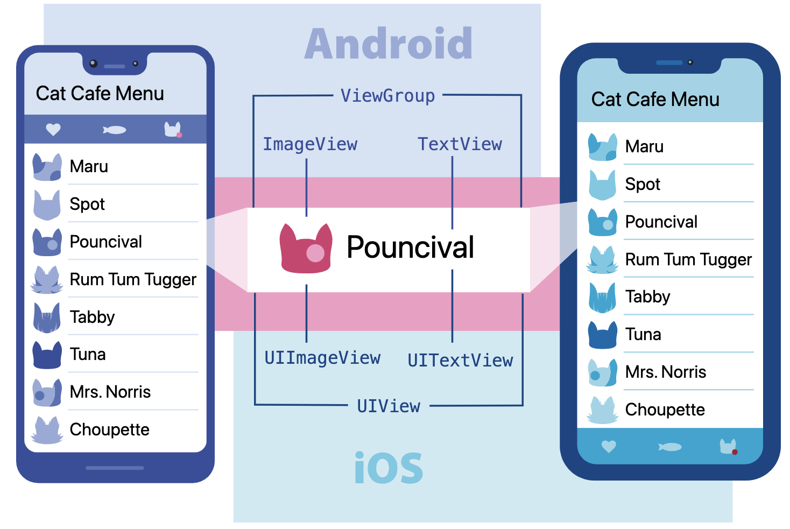
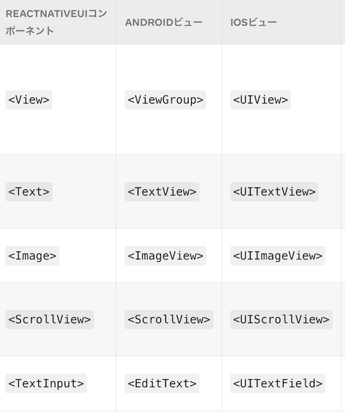
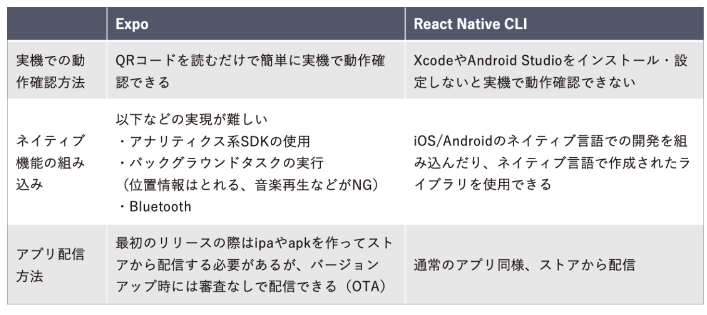
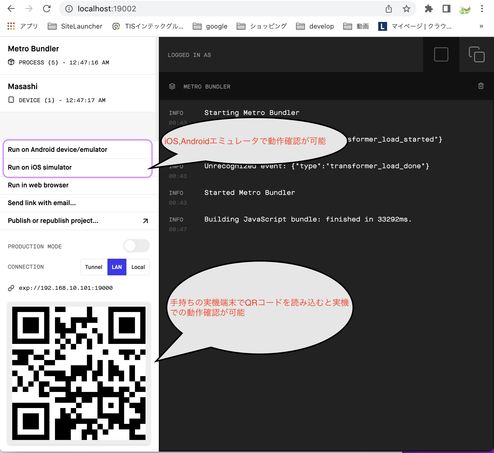
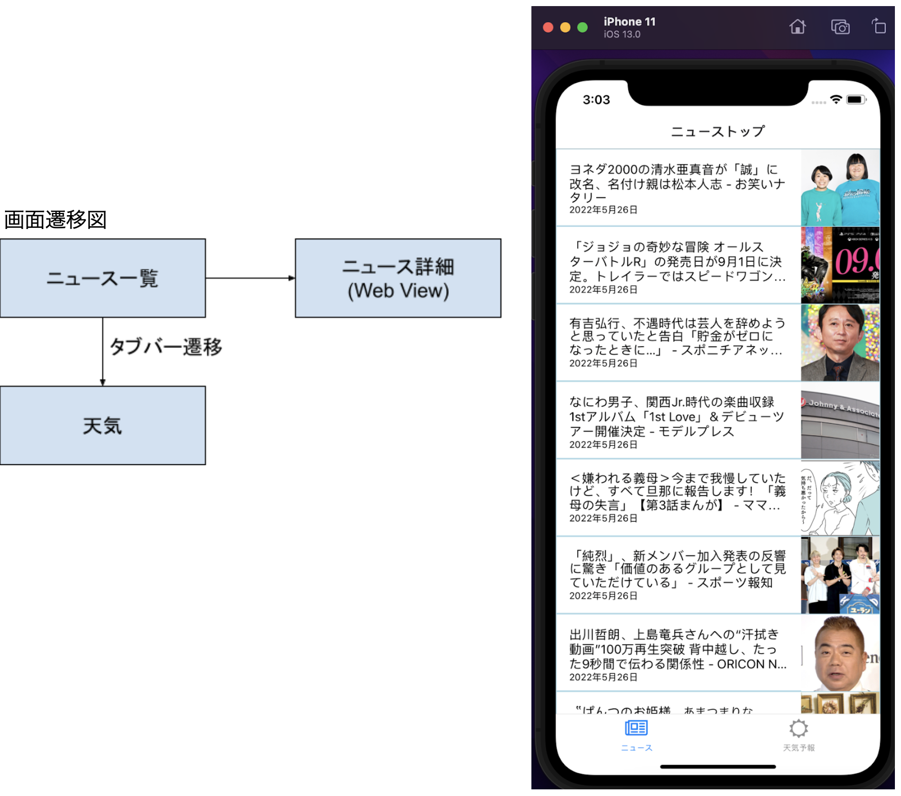
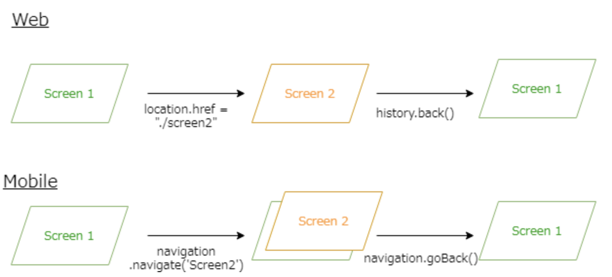
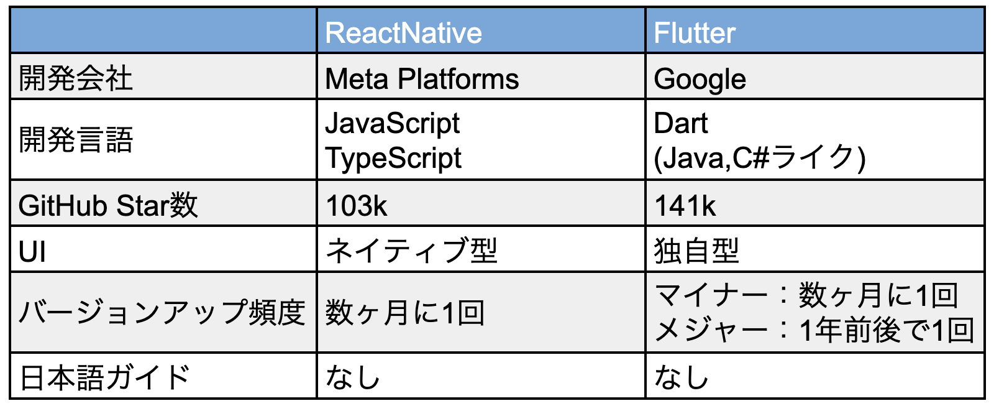

# ReactNative,expo を使ったクロスプラットフォームモバイルアプリ開発

## ReactNative について

Meta Platforms 社(旧 Facebook 社)が開発したオープンソースのクロスプラットフォームアプリ開発用フレームワーク。  
開発言語は JavaScript または TypeScript。

### クロスプラットフォーム対応の仕組み

ネイティブアプリは下図のように複数の View から画面が構成されている。


ReactNative は両方の View に対応する**Component**と呼ばれるものを提供しており、Component を組み合わせて画面開発を行うことで、Android,iOS 両方で動作するアプリを作成することができる。  
代表的な Conponent とそれに対応する View は以下の通り。



### ReactNative の採用事例

- Facebook
- Instagram
- Uber Eats
- Skype

## expo について

ReactNative アプリを開発するための便利機能を集めたプラットフォーム。
ReactNative には**Expo**と**ReactNative CLI**という 2 つの開発ツールが存在する。  
両者の主な違いについては以下の通り。



Expo は、ネイティブ機能の組み込みに制約がある一方で、実機での動作確認が容易にできる、アプリの更新時にストアの審査が不要などのメリットがる。  
ただし注意点として、Expo で使用している ReactNative は最新のバージョンから少し遅れる場合がある。  
これは、Expo は React Native を Fork し、そのアップデートに追従しながら SDK に組み込んでいるためである。  
ちなみにリリース頻度としては Expo が 3 ヶ月に一度（3, 6, 9, 12 月）の定期リリース、ReactNative は不定期(最近では数ヶ月に 1 回)のリリースとなっている。

## 環境構築

### Node.js のインストール

事前に[Node.js](https://nodejs.org/ja/)をインストールしておく。

### expo のインストール

expo をインストールする。  
インストールすると expo コマンドが使えるようになる。

```text
npm install -g expo-cli
```

### プロジェクトの作成

expo init コマンドを使ってプロジェクトを作成する。

```text
expo init AwesomeProject
```

JavaScript,TypeScript どちらで開発するのかや、どのような雛形を作成するかを聞かれるので合ったものを選択する。  
少し待つとプロジェクトが作成される。

```text
? Choose a template: › - Use arrow-keys. Return to submit.
    ----- Managed workflow -----
    blank               a minimal app as clean as an empty canvas
❯   blank (TypeScript)  same as blank but with TypeScript configuration
    tabs (TypeScript)   several example screens and tabs using react-navigation and TypeScript
    ----- Bare workflow -----
    minimal             bare and minimal, just the essentials to get you started

```

アプリを起動するには、プロジェクトのルートディレクトリで起動コマンドを実行する。

```text
cd AwesomeProject
expo start
```

コマンドを実行すると以下のような画面を開くことができる。 s
エミュレータや実機端末での確認を簡単に行うことができる。  

※注意事項
iOS エミュレータは XCode が必要なので開発 PC が Mac である必要がある。  
実機で確認するには事前に[Expo Go](https://expo.dev/client)というアプリをインストールしておく必要がある。
実機と開発 PC は同じネットワークに接続されている必要がある。

## サンプルアプリの作成

### アプリ概要

エンタメニュースと、全国の天気が見れるサンプルアプリを作成する。


### クラスの基本構成

画面(コンポーネントの組み合わせ)を返却する関数と、スタイルを定義する。

```typescript:NewsScreen.tsx
// 画面をreturnする関数を定義する
export default function NewsScreen({ navigation }) {
  const [news, setNews] = useState([]);

  useEffect(() => {
    getNews();
  }, []);

  const getNews = async () => {
    const response = await axios.get(URI);
    setNews(response.data.articles);
  };

  return (
    // コンポーネントを組み合わせて画面を定義する
    <SafeAreaView style={styles.container}>
      <FlatList
        data={news}
        renderItem={({ item }) => (
          <NewsKizi
            imageurl={item.urlToImage}
            title={item.title}
            subtext={item.publishedAt}
            onPress={() => navigation.navigate("詳細ページ", { article: item })}
          />
        )}
        keyExtractor={(item, index) => index.toString()}
      />
    </SafeAreaView>
  );
}

// コンポーネントのスタイルを定義する
const styles = StyleSheet.create({
  container: {
    flex: 1,
    backgroundColor: "#fff",
  },
});
```

### API 呼び出し

ReactNative 標準の HttpClient はないため、[axios](https://axios-http.com/docs/intro)というライブラリを使用するのが一般的。

```typescript
import axios from "axios";
:
const response = await axios.get(URI);
```

### 状態管理

画面内で動的に変更する値については状態管理を行う。  
状態管理には useState を以下のように用いる。  
左辺の 1 つ目の変数には管理するオブジェクトの変数名、2 つ目には変数を更新する関数名を指定する。  
右辺には引数に管理対象オブジェクトの初期値を指定した useState を設定する。

```typescript
import React, { useState } from "react";
:
// 状態管理オブジェクトの宣言・初期化
// newsというオブジェクトを空の配列で初期化し、更新にはsetNews関数を使用するよう宣言している
const [news, setNews] = useState([]);
:
const getNews = async () => {
  const response = await axios.get(URI);
  // newsを更新する場合はsetNewsを使って更新する
  setNews(response.data.articles);
};
```

### 子コンポーネントと値の受け渡し

ReactNative もコンポーネント志向のフレームワークであり、役割に応じて画面をいくつかのコンポーネントに分割する。  
サンプルアプリでは以下のように 1 つ分のニュース記事を別コンポーネントに切り出して、繰り返し表示している。


子コンポーネントに値を渡す際には props という仕組みを使用する。  
サンプルでは「ニュースの見出し」、「日付」、「サムネ画像 URL」、「記事をクリックした時のコールバック関数」 を子コンポーネントに渡している。

親コンポーネント(NewsScreen.tsx)  
子コンポーネントの属性に受け渡す値を指定する。

```html:親コンポーネント
<FlatList
  data={news}
  renderItem={({ item }) => (
    <NewsKizi
      imageurl={item.urlToImage}
      title={item.title}
      subtext={item.publishedAt}
      onPress={() => navigation.navigate("詳細ページ", { article: item })}
    />
  )}
  keyExtractor={(item, index) => index.toString()}
/>
```

子コンポーネント(NewsKizi.tsx)  
NewsKizi の引数として受け取る。

```typescript:子コンポーネント
export default function NewsKizi({ imageurl, title, subtext, onPress }) {
:
  return (
    <TouchableOpacity style={styles.box} onPress={onPress}>
      <View style={styles.moziBox}>
        <Text numberOfLines={3} style={styles.text}>
          {title}
        </Text>
        <Text style={styles.subText}>{koukaihiduke}</Text>
      </View>
      <View style={styles.gazoBox}>
        <Image style={{ width: 100, height: 100 }} source={{ uri: imageurl }} />
      </View>
    </TouchableOpacity>
  );
}
```

### 画面遷移

モバイルアプリケーションでは Web アプリケーションと違い**スタック型**の画面遷移を採用している。  
画面遷移は今ある画面の上に新しい画面を積み重ねることで実現され、前の画面は破棄されずに残っている。  
戻る場合は、先頭の画面を取り除くなどで実現する。



ReactNative では標準の画面遷移ライブラリがないため、[React Navigation](https://reactnavigation.org/)というライブラリを使用するのが一般的。

画面遷移の定義  
遷移先名称と遷移先のコンポーネント(クラス名)を定義する。

```typescript:画面遷移の定義
import { NavigationContainer } from "@react-navigation/native";
import { createNativeStackNavigator } from "@react-navigation/native-stack";
:
const Root = createStackNavigator();
:
function App() {
  return (
    <NavigationContainer>
      <Root.Navigator>
        <Root.Screen name=name="ニューストップ" component={NewsScreen} />
        // 画面遷移処理で詳細ページという名称が指定された場合、詳細画面に遷移する
        <Root.Screen name="詳細ページ" component={DetailScreen} />
      </Root.Navigator>
    </NavigationContainer>
  );
}
```

画面遷移実装  
navigation.navigate で画面遷移を行うことができる。  
第一引数に遷移先名称、第二引数に渡したい値を指定することができる。

```typescript
export default function NewsScreen({ navigation }) {
:
  return (
    <SafeAreaView style={styles.container}>
      <FlatList
        data={news}
        renderItem={({ item }) => (
          <NewsKizi
            imageurl={item.urlToImage}
            title={item.title}
            subtext={item.publishedAt}
            // 詳細ページに記事の情報を渡して画面遷移する
            onPress={() => navigation.navigate("詳細ページ", { article: item })}
          />
        )}
        keyExtractor={(item, index) => index.toString()}
      />
    </SafeAreaView>
  );
```

## 他フレームワークとの比較

他のクロスプラットホームアプリ向けフレームワークとしては**Flutter**が挙げられる。  
近年では Flutter が人気を博している。  
主な違いは以下の通り。



### 学習ハードルについて

ReactNative は JavaScript ベースなので、Angular,Vue,React 等のフロント系フレームワーク経験者ならば比較的取り組みやすい。  
特に React 経験者ならば、書き方がほぼ一緒なので学習ハードルは低い。  
一方 Flutter は Dart というなかなか扱わない言語ではあるものの、書き方は Java と似ているので、バックエンド経験者ならば ReactNative より取り組みやすい。

## 参考リンク

[サンプルアプリとこのメモ](https://github.com/Yoshi034/react-native-sample-expo)  
[ReactNative 公式](https://reactnative.dev/)  
[expo 公式](https://docs.expo.dev/)  
[TIS Fintan](https://fintan.jp/page/1425/)
